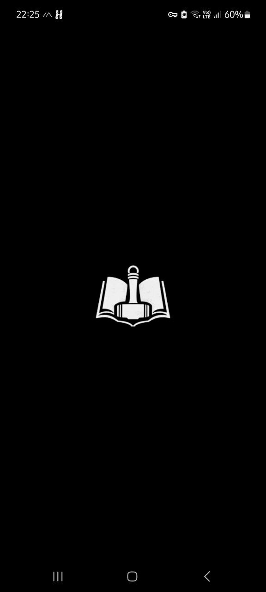
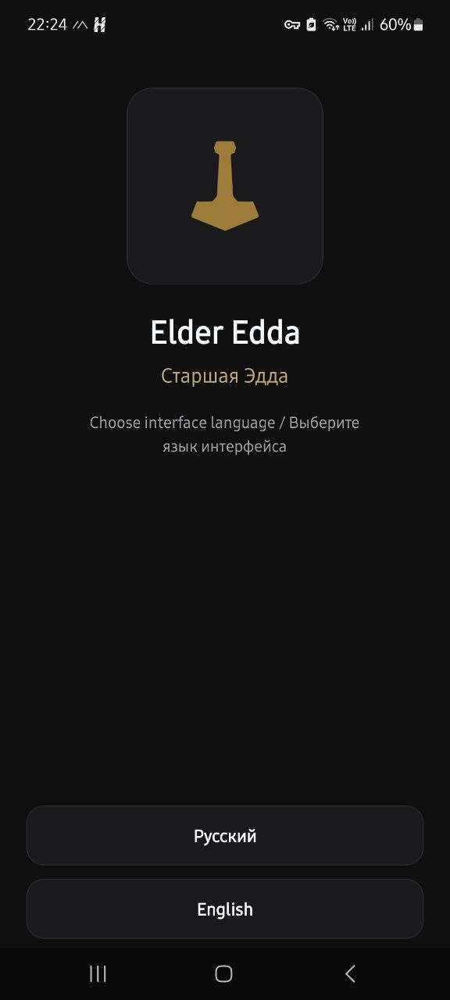
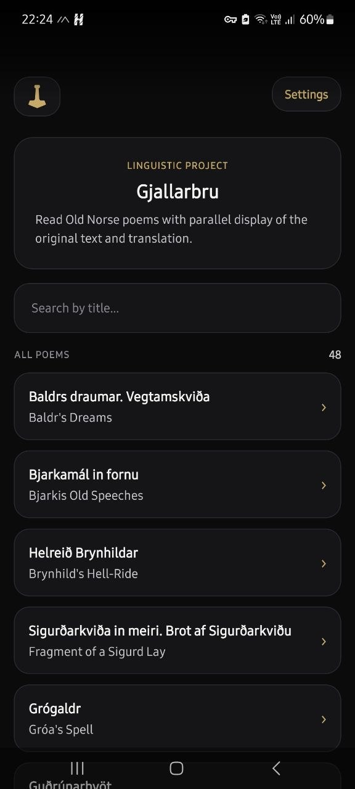
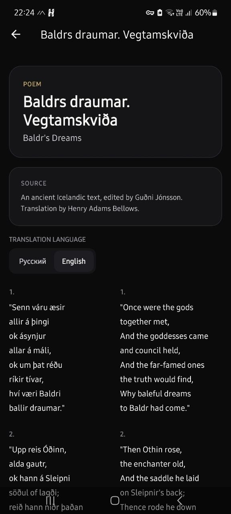
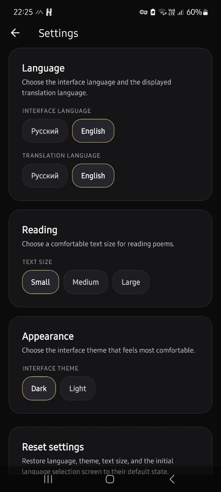

<p align="center">
  
</p>


# Gjallarbru

Offline mobile application for reading Old Norse poetry with parallel translations.

---

## 📱 About

Gjallarbru is an offline-first mobile application built with React Native (Expo).
It is designed for comfortable reading of Old Norse poems alongside translations.

The app displays the original Old Norse text together with Russian or English translations in a clean and structured format.

The entire application works without an internet connection.

---

## ✨ Features

* 📖 Read Old Norse poems
* 🌐 Switch translation language (Russian / English)
* 🔍 Search across all texts (Old Norse, RU, EN)
* ⚙️ Adjustable font size
* 🎨 Light and dark themes
* 💾 Fully offline — no network required

---

## 🧠 Reading Format

The app supports two types of content blocks:

### Stanza

* Displayed in two columns
* Left: original Old Norse
* Right: translation

### Prose

* Displayed vertically
* Original text first
* Translation below

All texts are preprocessed and aligned for consistent reading.

---

## 📂 Data Structure

Each poem is stored as a separate JSON file.

```json
{
  "slug": "poem-slug",
  "title": {
    "on": "Old Norse title",
    "ru": "Russian title",
    "en": "English title"
  },
  "texts": {
    "on": [],
    "ru": [],
    "en": []
  }
}
```

Text blocks are synchronized across languages using placeholders when needed.

---

## 🛠 Tech Stack

* React Native (Expo)
* TypeScript
* Zustand (state management)
* expo-router
* react-i18next (used only for interface)

---

## 📸 Screenshots

<p align="center">
  
  
  
  
  
</p>

---

## 📦 Installation (APK)

You can install the application manually:

1. Download the latest APK release
2. Enable installation from unknown sources on your device
3. Install the APK

---

## 🧑‍💻 Development

Clone the repository:

```bash
git clone https://github.com/Jardarr/gjallarbru.git
cd gjallarbru
```

Install dependencies:

```bash
npm install
```

Run the project:

```bash
npx expo start
```

---

## 🏗 Build

### Option 1 — Local build (recommended)

```bash
npm install
npx expo prebuild
cd android
./gradlew assembleRelease
```
APK files will be generated in: android/app/build/outputs/apk/release/

---

## 📁 Project Structure

```bash
src/
  components/
  hooks/
  lib/
  store/
  theme/
data/
  poems/
```

All poems are stored locally and bundled with the app.

---

## ⚙️ Build Requirements

- Node.js
- npm
- Android SDK
- Java (JDK 17)

The project is built locally using Gradle.

---

## 🔒 Privacy

Gjallarbru does not collect, store, or transmit any personal data.
The application works entirely offline.
The application does not use any network connections, analytics, or tracking libraries.

---

## 📜 License

This project is licensed under the MIT License.

---

## 👤 Author

jrdrr
https://github.com/Jardarr
